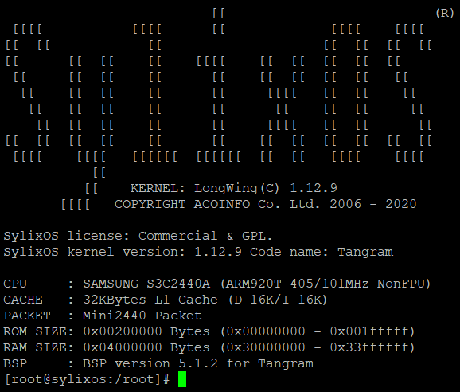

# Design Report of Project 2

## Group Info

### Project Objective

Design and improve the command line mechanism of `SylixOS`.

### Group ID

We are Group-11.

### Group Member

| Name   | SID      |
| ------ | -------- |
| 徐向宇 | 11810113 |
| 罗叶安 | 11810616 |
| 李昊锦 | 11810911 |

## Group Background And Description

### Introduction to SylixOS

`SylixOS` is a large-scale embedded real-time operating system (OS), with a completely China-made kernel.

Real-time operating system (RTOS) refers to an OS intended to run real-time applications that process the data when it is is inputted into the system, typically without buffer delays. 

Embedded system refers to operating system that runs on embedded devices. Embedded devices typically use special OS, which is RTOS in most cases.

As a preemptive multitasking hard real-time operating system, SylixOS has the many useful functions and characteristics. Some of which might be related to our project are listed as following:

1. Compatible with POSIX 1003.1b (ISO/IEC 9945-1) real-time programming standard
2. Support unlimited multitasking
3. Support a variety of emerging asynchronous event synchronization interfaces, such as: `signalfd`, `timerfd`, `eventfd`, etc.
4. Support extended system symbol interface
5. Support standard `TCP` / `IPv4` / `IPv6` dual network protocol stack and provide standard socket operation interface
6. Internal integration of many network tools, such as: `FTP`, `TFTP`, `NAT`, `PING`, `TELNET`, `NFS`, etc.
7. Internal integrated shell interface, support environment variables (basically compatible with Linux operating habits)
8. Support many standard equipment abstractions, such as: `TTY`, `BLOCK`, `DMA`, `ATA`, `GRAPH`, `RTC`, `PIPE`, etc.
9. The kernel, drivers, and applications support GDB debugging
10. Provide a kernel behavior tracker to facilitate application performance and failure analysis

### Introduction to TTinyShell

SylixOS has its own command line interface, which is named as `TTinyShell`. 

The experience of ttinyShell is similar to that of `Bash` or other shell program on Linux. There are some built-in commands such as `help`, `echo`, `ps`, `kill`, `ifconfig`, `shutdown`, `reboot` and so on.

Besides, ttinyShell has already included a basic auto-completion function. When typing in the prefix of the files in the current folder or `Home` folder,  it could automatically complete the rest; and if there are multiple file names share the same prefix, then the alternative will be also shown just below the current line. It's actually similar to `Bash`.

TTinyShell has no pipeline, no output filter, and no divi-screen display. It also supports shell scripts, but complicated mechanisms like `if` / `else` / `while` could not be used in the scripts yet.

### Tools We will Use

#### 1. RealEvo-IDE

`RealEvo-IDE` is a SylixOS dedicated operating system integrated development environment. It's a Eclipse-like software, and it includes:

1. SylixOS Base project, which includes `libsylixos` (the kernel of SylixOS) , `libcextern` (C extension library), `libreadline`, `liblua`, `libluaplugin`, `libzmodem`, `libsqlite3`, etc.
2. Various Project Template: `BSP` project, application project, kernel module project, etc.
3. Some built-in tools, such as auto-commit tool, kernel behavior  monitor, etc.
4. IDE: helps us to manage, construct and compile projects, and provides supports for different tool-chain
5. Tool-chains: compilers under different platforms, includes ARM, PowerPC, x86, x86_64, DSP, SPARC, Lite, RISC-V, etc.

#### 2. RealEvo-Simulator

`RealEvo-Simulator` is a hypervisor for SylixOS virtual machines. Since `RealEvo-Simulator` runs VMs, it would not require the CPU architecture type of the host machine. It provides putty-based telnet terminal for users to interact with the VMs, and help users to configure the network adapters of the host machine.

## Implementation

## Expected Goals

## Division of Labors

## Reference

1. `SylixOS_application_usermanual.pdf`
2. `SylixOS shell 增强开发指导文档.docx`

3. https://en.wikipedia.org/wiki/Operating_system
4. 