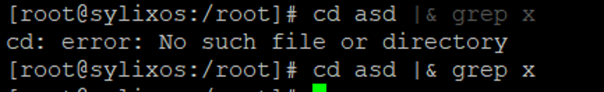
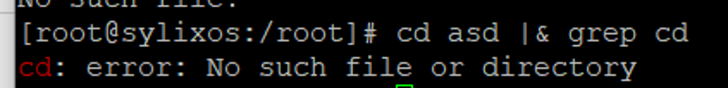
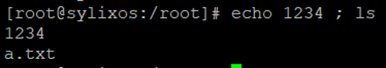
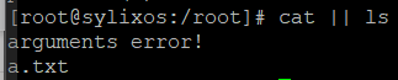
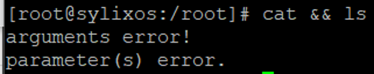
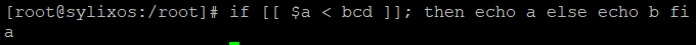
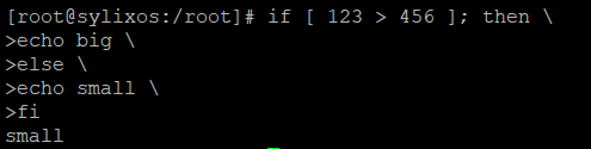
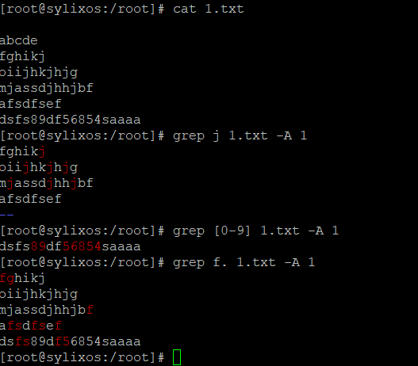
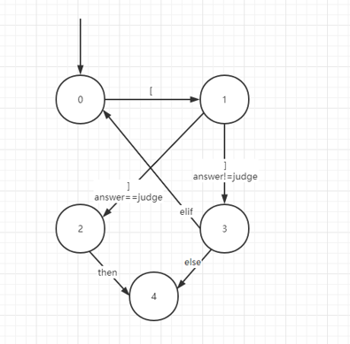

# Final Report

## Group Info

### Project Title

proj12-shell-enhancement-on-SylixOS

### Project Objective

Design and improve the command line mechanism of `SylixOS`.

## Project Background and Description

### Introduction to SylixOS


`SylixOS` is a large-scale embedded real-time operating system (OS), with a completely China-made kernel.

Real-time operating system (RTOS) refers to an OS intended to run real-time applications that process the data when it is is inputted into the system, typically without buffer delays. 

Embedded system refers to operating system that runs on embedded devices. Embedded devices typically use special OS, which is RTOS in most cases.

As a preemptive multitasking hard real-time operating system, SylixOS has the many useful functions and characteristics. Some of which might be related to our project are listed as following:

1. Compatible with POSIX 1003.1b (ISO/IEC 9945-1) real-time programming standard
2. Support unlimited multitasking
3. Support a variety of emerging asynchronous event synchronization interfaces, such as: `signalfd`, `timerfd`, `eventfd`, etc.
4. Support extended system symbol interface
5. Support standard `TCP` / `IPv4` / `IPv6` dual network protocol stack and provide standard socket operation interface
6. Internal integration of many network tools, such as: `FTP`, `TFTP`, `NAT`, `PING`, `TELNET`, `NFS`, etc.
7. Internal integrated shell interface, support environment variables (basically compatible with Linux operating habits)
8. Support many standard equipment abstractions, such as: `TTY`, `BLOCK`, `DMA`, `ATA`, `GRAPH`, `RTC`, `PIPE`, etc.
9. The kernel, drivers, and applications support GDB debugging
10. Provide a kernel behavior tracker to facilitate application performance and failure analysis

### Introduction to TTinyShell


SylixOS has its own command line interface, which is named as `TTinyShell`. 

The experience of ttinyShell is similar to that of `Bash` or other shell program on Linux. There are some built-in commands such as `help`, `echo`, `ps`, `kill`, `ifconfig`, `shutdown`, `reboot` and so on.

Besides, ttinyShell has already included a basic auto-completion function. When typing in the prefix of the files in the current folder or `Home` folder,  it could automatically complete the rest; and if there are multiple file names share the same prefix, then the alternative will be also shown just below the current line. It's actually similar to `Bash`.

TTinyShell has no pipe, no output filter, and no divi-screen display. It also supports shell scripts, but complicated mechanisms like `if` / `else` / `while` could not be used in the scripts yet.

## Result Analysis

### Keyword Auto Completion

When `Tab` is pressed and there is only one word in the input buffer, similar keywords will be shown.


### History Auto Suggestion

#### 1. Visual Effect

If we input the prefix of a command which was input before, the rest will be shown.


If we move the cursor to the right and press `ENTER`, the commands could be input correctly.


#### 2. New commands

There are two new commands related to this function: `clearhistory` , 


And `loadhistory`.


### *ls* and *ll* Enhancement

By default, `ll` and `ls ` will always show all the files in the specified directory, whether or not their names start with ".", and there is no argument like `-a` nor `--all` supported. So we implement the function of "hidden files/folders".


### pipe

Use `|` to call the pipe to transmit the standard output left command to the right command.



|& is used to transmit both standard output and standard error.



### logic

1. `;` is used to split statement into two instructions and execute them.



2. `||` is used to split statement into two instructions, execute first command and then execute second command if first command executes wrongly.



3. `&&` is used to split statement into two instructions, execute first command and then execute second command if first command executes correctly.



### IF ELSE

The standard format is like `  x=6; if [ $x < 1 ]; then echo small elif [ $x < 5 ]; then echo middle else echo big fi `.


It supports comparison between integers and variables.

If want to compare strings, use `[[]]`  like ` if [[ abc > cb ]]; then echo abc else echo cb fi`.



It can use line break `\` to use with multiple lines:



### Grep command

SylixOS does not support **grep** function. Therefore, we implemented a grep function which has some functions similar to them of grep in linux. Besides filtering text from any file input, it can accept **-n** argument to label the index of each row, **-A number** to also display **number** rows after the rows containing our search target. It accepts regular expression as search string to match patterns in the input file. It also accepts argument **-N** to disable the regular expression to perform a pure string matching. The following images demonstrate the usages of our grep function.</br>

This shows the result of performing a regular expression pattern matching combined with "-A" argument.</br>


This shows the result of performing a regular expression pattern matching combined with "-A" and "-n" arguments. It has a similar behavior with linux's grep.</br>


This shows the result of performing a regular expression pattern matching given a complicated regular pattern.</br>


This shows the result of performing a regular expression pattern matching combined with our pipeline scheme.</br>


## Implementation

### Keyword Auto Completion

Actually, ttinyShell already has the function of auto-completion, however, only names of files/directories could be matched. Here we implement the function of keyword-completion.

In SylixOS, not all shell commands are stored as files in the file system, which means that we cannot just scan all the files in the `PATH` directories and match the most similar one.

Commands in ttinyShell are named as `keyword`, and some APIs related to this function are already included in file `ttinyShellLib.c`. For example, the following function will return all keyword in an array.

```c
ULONG  __tshellKeywordList (__PTSHELL_KEYWORD   pskwNodeStart,
                            __PTSHELL_KEYWORD   ppskwNode[],
                            INT                 iMaxCounter);
```

Besides, as no executable files or shell script could be executed directly in ttinyShell (it means that we must run the program with the commands ` ./xxx.bin`), the first term in a valid command should always be a **keyword**. So our design logic is that, if there is only one term in the commands, only keyword-completion will be used, otherwise only filename-completion will be used.

### History Auto Suggestion

Basically, we implement this function with the data structure *Prefix Tree*, also named as *Trie*. The following image is an example for how to use trie to represent the history commands. (Input commands: `ifconfig`, `loglevel`, `logfiles`) 


Two new source files are added into the directory `libsylixos/SylixOS/kernel/tree`, which are `trie.c` and `trie.h`. 

Trie node struct is defined as follows:

```c
typedef struct __trie_node {
    unsigned            isValid:1;               /*  child是否被初始化      */
    unsigned            isEnd:1;                 /*  是否是某个指令的结尾    */
    unsigned            frequence:15;            /*  此节点被使用的频率      */
    unsigned            maxFrequence:15;         /*  子节点中最大使用频率    */
    char                mostFrequentlyUsedChar;  /*  最常使用子节点         */
    struct __trie_node *child;                   /*  如被初始化, 则是一个长为256的指针数组     */
} LW_TRIE_NODE;
typedef LW_TRIE_NODE   *PLW_TRIE_NODE;
```

Several important macro function and functions are defined here.

`ENLARGE_LIST()` is used for the self-defined arraylists.

```c
#define ENLARGE_LIST(array_list, original_length_element, element_type, pointer_type)
```

`INITIALIZE_TRIE_NODE` is used for assigning initial values for the attributes in the structure.

```c
#define INITIALIZE_TRIE_NODE(trieNode)
```

`__trieNodeValidate` will allocate memory for the child array.

```c
VOID __trieNodeValidate(PLW_TRIE_NODE trieNode);
```

`__trieInsert` inserts a string into the trie, and update the frequency of passed nodes. 

```c
VOID __trieInsert(PLW_TRIE_NODE trieNode, PCHAR sentence, int n);
```

`__trieSearch`: if the input string cannot be found in the trie, return null; otherwise output the postfix of the most frequently used command with a prefix equal to the current command. 

```c
PCHAR __trieSearch(PLW_TRIE_NODE trieNode, PCHAR sentence, int n);
```

`__trieDelete` will delete all allocated memory of a trie recursively.

```c
VOID __trieDelete(PLW_TRIE_NODE trieNode);
```

`__trieToFile` and `__trieFromFile` are two functions used to transform a trie into sequential bytes. We use BFS algorithm here to traverse every node in the trie, and the trie is represented sequentially in a `Leetcode` way. Read [this website](https://support.leetcode.com/hc/en-us/articles/360011883654-What-does-1-null-2-3-mean-in-binary-tree-representation-) to know more about how does Leetcode represents tree in the OJ. 

```c
VOID            __trieToFile(PLW_TRIE_NODE trieNode, FILE *file);
PLW_TRIE_NODE   __trieFromFile(FILE *file);
```

The history trie will be initialized when the function `__tshellReadlineInit` is called. If a history recording file specified for the current user could be found, the new trie will be restored from the binaries; if not the new trie will be only an empty trie. The logics mentioned above are in the function `__tshellInitHistoryTrie`.

```c
static VOID __tshellInitHistoryTrie(VOID);
```

  Whenever a normal char is input into the shell, the function `__tshellCharInster` will be called. Then in the end of the function processing, `__trieSearch` will be used and the output will be directly print to the terminal.


When a command is executed successfully after `ENTER` pressed, the function `__tshellAfterExecution` will be called, and it will record the new command and store it into the history trie.

```c
VOID __tshellAfterExecution(PVOID  pcBuffer, size_t  stSize, INT returnValue);
```

All matched string will be stored. If `RIGHT` is pressed and the cursor is at the end of the command, the first character will be included in the current input buffer, and the stored matched string will be updated.

Also, two new commands `clearhistory` and `loadhistory` are created. The implementation logic are similar with what we have mentioned above. The way to register a new command will be shown in the next part.

### *ls* and *ll* Enhancement

Before the introduction in this part,  we should firstly explain how a command is registered into kernel.

There are totally 3 functions related to this topic:

`API_TShellKeywordAdd`  could register a handler function for the name of the new command.

```c
ULONG  API_TShellKeywordAdd(CPCHAR pcKeyword, PCOMMAND_START_ROUTINE pfuncCommand);
```

`API_TShellFormatAdd` and `API_TShellHelpAdd` are used to add "help" infos.

```c
ULONG API_TShellFormatAdd(CPCHAR pcKeyword, CPCHAR pcFormat);
ULONG API_TShellHelpAdd(CPCHAR pcKeyword, CPCHAR pcHelp);
```

Let's take some source code as an example. The following codes shows all of what we need to do of registering a new command.

```c
API_TShellKeywordAdd("echo", __tshellSysCmdEcho);
API_TShellFormatAdd("echo", " [message]");
API_TShellHelpAdd("echo", "echo the input command.\necho [message]\n");
```

The handler function should be defined in this way:

```c
static INT  __tshellSysCmdEcho (INT  iArgC, PCHAR  ppcArgV[]);
```

`ppcArgV` means all input parameter in the command divided by space, and `iArgC` means the number of all the arguments.

The system command `ls` and `ll` are defined in the file `libsylixos\SylixOS\shell\fsLib\ttinyShellFsCmd.c` by the following handler functions:

```c
static INT  __tshellFsCmdLs (INT  iArgC, PCHAR  ppcArgV[]);
static INT  __tshellFsCmdLl (INT  iArgC, PCHAR  ppcArgV[])
```

In the previous implementation, no additional arguments are supported, including `-a` and `--all`. By default, all file entries will be shown regardless of whether they should be hidden or not.

The rest part of our modification is clear. Firstly, we just read all input arguments and set a flag if `-a` or `--all` are input:

```c
for (index = 1; index < iArgC; index++) {
	...
	if (lib_strcmp(ppcArgV[index], "-a") == 0 || lib_strcmp(ppcArgV[index], "--all") == 0) {
            isAll = LW_TRUE;
	...
}
```

Then, do not print the result if the flag `isAll` is on or if the filename does not start with ".".

```c
if (isAll || *(pdirent->d_name) != '.') {
	<<<PRINT A FILE ENTRY>>>
}
```

So that's all of what we have done for this part. It's simple, but we have learned a lot about the utilization of the command registration APIs.

### pipe

In the beginning, we tried to use pipe() and dup2() to realize pipe to transmit from stdout to stdin but failed, because some commands like cat doesn't read from stdin and the processes in SylixOS is complicated. So then I use intermediate file to realize: first redirect the first command to intermediate file, then pass it as argument into second command and finally, remove the intermediate file. 


In total , we use its redirection function and command reading file to realize pipe. For `|`, we use `>` and for `|&` we use `1> 2>` to pass both stdout and stderr.  And its redirection itself with standard error is not complete, so the `|&` may lose some error information. 

The main part of the modified codes are in the `__tshellExec` function. And we call itself recursively to create and remove the intermediate file under different circumstances.

```
            INT first= __tshellExec((CPCHAR)firstCmd,pfuncHook);
            if(first<0 && *(tempCmd-1)!='&'){
                __tshellExec((CPCHAR)rmCmd,pfuncHook);
                return first;
            }
```

```
                    int second= __tshellExec((CPCHAR)secondCmd,pfuncHook);
                    __tshellExec((CPCHAR)rmCmd,pfuncHook);
                    return second;
```

And because we use the intermediate file, the cd command is not suitable for pipe. So we modify the `__tshellFsCmdCd` and `__tshellFsCmdCat` functions to realize the cd with fifo and it can read the intermediate file's content so that cd is suitable for pipe.

```
                INT ret = mkfifo(_pipeName,0777);
                ...
                INT fd=open(_pipeName,O_RDWR);
                CHAR cBuffer[MAX_FILENAME_LENGTH];
                INT sstNum=read(fd, cBuffer, MAX_FILENAME_LENGTH);
                if(sstNum<0)
                    iError= -1;
                else{
                    INT temp=1;
                    while(cBuffer[sstNum - temp] == '\n' ||cBuffer[sstNum - temp] == ' '){
                        cBuffer[sstNum - temp]=PX_EOS;
                        temp++;
                    }
                    iError=cd(cBuffer);
                    if (iError){
                        fprintf(stderr, "cd: error: %s\n", lib_strerror(errno));
                    }
                }
                close(fd);
                unlink(_pipeName);
                ...
```

### logic

We can traverse the statement to find `||` , `&&` or `;` and split the statement into two commands.

Then execute the first command, according to the result and the logic symbol to judge whether to execute the second command.

```
        if(index1==2){
            *(tempCmd-1)=PX_EOS;
            int first=__tshellExec((CPCHAR)pcCmd,pfuncHook);
            if(first<0){
                tempCmd++;
                return __tshellExec((CPCHAR)tempCmd,pfuncHook);
            }
            return first;
        }
        if(*(tempCmd)=='&')
            index2++;
        else
            index2=0;
        if(index2==2){
            *(tempCmd-1)=PX_EOS;
            int first=__tshellExec((CPCHAR)pcCmd,pfuncHook);
            if(first>=0){
                tempCmd++;
                return __tshellExec((CPCHAR)tempCmd,pfuncHook);
            }
            return first;
        }

        if(*(tempCmd)==';'){
            *(tempCmd)=PX_EOS;
            INT error1=__tshellExec((CPCHAR)pcCmd,pfuncHook);
            tempCmd++;
            INT error2=__tshellExec((CPCHAR)tempCmd,pfuncHook);
            return (error1<error2)?error1:error2;
        }
```

### IF ELSE

In the implementation of IF ELSE, we don’t use interpreter but a state transition machine to realize it manually. 



We realize it in _tshellIfElse(). At first, it is  in the status 0, and when finding `[` , it will get the status 1. In the process with status 1,  it will collect the left string and right string into two char*.

```
            INT status=0;    /*0表示未遇到[，1表示未遇到]，2表示未遇到then，3表示未遇到elif或else,4 表示执行后续的指令  */
            tempcCommand+=2;
            char left[1024];
            PCHAR leftPoint=left;
            INT leftMeet=0;  /*0表示还没有遇到，1表示遇到了，2表示结束了 */
            char right[1024];
            PCHAR rightPoint=right;
            INT rightMeet=0;  /*0表示还没有遇到，1表示遇到了，2表示结束了 */
            INT judge=-1;    /*-1表示还没有遇到，0表示等于，1表示小于，2表示大于  */
            INT answer=-1;   /*-1表示还没有计算，0表示等于，1表示小于，2表示大于  */
            INT string=0;   /*0表示正常，1表示是string */
```

```
switch(status)
                {
                case 1:
                    if(judge==-1){
                        if(leftMeet==1){
                           ...
                        }else if(leftMeet==0 && (*tempcCommand!=' ' || __tshellCheck(tempcCommand,"\""))){
                            ...
                        }else if(leftMeet==2){
                            ...
                        }
                    }else{
                        if(rightMeet==0 && (*tempcCommand!=' ' || __tshellCheck(tempcCommand,"\""))){
                           ...
                        }else if(rightMeet==1){
                           ...
                        }
                    }
                    break;
```

Then when it comes to `]` , it will calculate whether the condition is true. If with `[]`, it is comparison between integers with values. And if with `[[]]`, it is comparison between strings with lexicographical order.

```
                    if(string){
                        leftPoint=left;
                        rightPoint=right;
                        while(!__TTINY_SHELL_CMD_ISEND(leftPoint) && !__TTINY_SHELL_CMD_ISEND(rightPoint)){
                            if(*leftPoint==*rightPoint)
                                continue;
                            else if(*leftPoint<*rightPoint)
                                answer=1;
                            else
                                answer=2;
                            break;
                        }
                        if(answer ==-1){
                            ...
                        }
                    }else{
                        INT leftNum=0;
                        leftPoint=left;
                        INT rightNum=0;
                        rightPoint=right;
                        ...
                    }
                    if(answer==judge){
                        status=2;
                    }
                    else{
                        status=3;
                    }
                    tempcCommand+=2;
                    ...
                }
```

After the calculation, it will get status 2 or 3, if 2, it will find `then` to change status to 4 and then execute the command.

```
                case 4:
                    {
                        char execCmd[1024];
                        PCHAR execCmdPoint=execCmd;
                        while(!__tshellCheck(tempcCommand,"fi") && !__tshellCheck(tempcCommand,"elif")
                                && !__tshellCheck(tempcCommand,"else") && !__TTINY_SHELL_CMD_ISEND(tempcCommand)){
                            *(execCmdPoint++)=*(tempcCommand++);
                        }
                        *execCmdPoint=PX_EOS;
                        return __tshellExec((CPCHAR)execCmd,pfuncHook);
                    }
                }
```

If 3, it will find `else` or `elif`. With else, it will get status 4 like then; with elif, it will get status 0 like beginning.

And we find that SylisOS replace variable with “ \” ”, so we deal with the problem. In the process, we find that the single" symbol will be ignored.

```
if(__tshellCheck(tempcCommand,"\"")){
...
}
```

Before the function , we have completed the variable replacement so it supports variable.

```
    ulError = __tshellStrConvertVar(pcCmd, cCommandBuffer);             /*  变量替换                    */
    if (ulError) {
        return  ((INT)(-ulError));                                      /*  替换错误                    */
    }

    //change
    PCHAR tempcCommand=cCommandBuffer;
    INT ifelse=_tshellIfElse(tempcCommand,pfuncHook);
```

### *grep* command

In SylixOS, we use the following functions to register a command. Such command does not require a binary file.

```c
LW_API  
ULONG  API_TShellKeywordAdd (CPCHAR  pcKeyword, PCOMMAND_START_ROUTINE  pfuncCommand);
```
The function's second argument is the function pointer of your command:
```c
typedef INT               (*PCOMMAND_START_ROUTINE)(INT  iArgC, PCHAR  ppcArgV[]);
```
Our `grep` function is defined as follow, where the first argument indicate the amount of arguments passed to `grep` command and the second argument is the argument list passed to `grep` command:
```c
static INT  __tshellSysCmdGrep (INT  iArgC, PCHAR  ppcArgV[]);
```
To parse the arguments and check whether each of them is set or not set, we used a automata in a for loop to parse all the arguments and a "mask" to store the user's choice.
```c
#define _AChoice 1
#define _nChoice 2
#define _NChoice 4

for(i = 1; i < iArgC; i++){
    if(strcmp(ppcArgV[i], "-A") == 0){
        currentSelection |= _AChoice;
        currentPhase = _AChoice;
    }
    else if (currentPhase == _AChoice){
        ANumber = atoi(ppcArgV[i]);
        currentPhase = 0;
    }
    else if (strcmp(ppcArgV[i], "-n") == 0){
        currentSelection |= _nChoice;
    }
    else if (strcmp(ppcArgV[i], "-N") == 0){
        currentSelection |= _NChoice;
    }
    else{
        if(pattern == NULL) pattern = ppcArgV[i];
        else if(path == NULL) path = ppcArgV[i];
    }
}
```
SylixOS has a POSIX regular expression library, but it cannot be referred by our `grep` function which is in the kernel. So we used code from a light weight [regular expression library](https://github.com/jserv/cregex) and modified it to transplant into SylixOS kernel. This regular expression library does not support multiple matches with one string, so we recursively perform the regular pattern matching on the remaining part of string after each time it matches something in that string.
```c
while(1){
    if (cregex_program_run(program, target + shift, matches, 20)/*The pattern is matched successfully*/) {
        //Store pattern occurence positions here......
        shift = (int) (matches[i + 1] - target);
        } else {
        break;
    }
}
```
The following 2 commands are used to output contents in a specific color and then reset the color to the original one.
```c
VOID  API_TShellColorStart2 (CPCHAR  pcColor, INT  iFd);
VOID  API_TShellColorEnd (INT  iFd);
```
Therefore, we use for loop and `putchar` function to mark the filtered pattern in light red, just as what `Linux`'s `grep` does.
```c
for(i = 0; i < search_string_length; i++){
    if(/*The current index in inside an interval of the pattern */){
        API_TShellColorStart2(LW_TSHELL_COLOR_RED, STD_OUT);
    }
    else{
        API_TShellColorEnd(STD_OUT);
    }
    putchar(search_string[i]);
}
```
If the user uses "-N" to perform a pure filtering, we use KMP algorithm to complete this work because it is fast enough and can find all the occurrence positions of a given string within another string.

## Future Direction

In the implementation of history-auto-suggestion function, there are two potential problems. Firstly, in our design, the OS will store the history commands into file when the terminal thread is down. However, if users just shutdown the terminal with the `CLOSE` button like this,


The history commands will **NOT** been stored. We guess that it's because the `CLOSE` button means turn off the power of the virtual machine, thus the hook functions related to thread closure will not be called. If we need to solve this problem, we should find a way to capture the signal of the ending of terminal thread, or make the OS to call all the hook functions before VM shutdown. The second problem is that, the readline functions related to `LEFT` , `RIGHT`, `UP`, `DOWN` buttons are somehow called after the cursor move in the terminal. This seems to be some sort of asynchronous mechanism, but we don't yet understand how it works. If we figure out the mechanism, we would be able to add more user-friendly functions to `ttinyShell`.

In the implementation of pipe, I thinks we can add more commands with pipe like wc. And for the commands reading stdin like cd, we should provide an interface to help them get information in the intermediate file more easily. 

At the same time, SylixOS's  redirection is not complete and have some problems which may influence our pipe. So if we can, improving the redirection may enhance shell further.

In IF ELSE part, we use the status transition machine not interpreter to realize. So it can realize other statements such as while, for and so on.  And it doesn't support operations between variables. So if possible, I think it is helpful to transplant an interpreter. It will realize the if else, while, for statements more conveniently. But it is not easy to make it.

Our `grep` function now has some basic functionalities. However, the `grep` in `Linux` has many advanced usages that have combined actions. The argument parsing and executing scheme might not be enough for adding new arguments. For example, to support "-A" and "-n" argument made us added code to output the result in both the original output function and the output function of "-A", which brang tremendous amount of smelly code into our design. The problem can be easily solved in object-oriented programming languages with some design patterns but much harder in C programming language. In future, we may try to refactor our `grep` function with visitor pattern or other design patterns to enable it to handle various types of arguments and their combination.

## Summary

In this project, we learned a lot about how shell works and how to install new system commands in the kernel. This is actually the first time for us to involve into such a large project written in C, allowing us to accumulate large project management, development of some experience. In the past month, our teamwork has always been simple and efficient, and we have had a good time.

## Reference

1. `SylixOS_application_usermanual.pdf`
2. `SylixOS shell 增强开发指导文档.docx`
3. `RealEvo-IDE_usermanual.pdf`
4. https://www.cnblogs.com/matthewma/p/6995479.html
5. https://en.wikipedia.org/wiki/Standard_streams
6. https://en.wikipedia.org/wiki/Operating_system
7. http://www.gnu.org/software/bash/manual/
8. https://github.com/jserv/cregex
